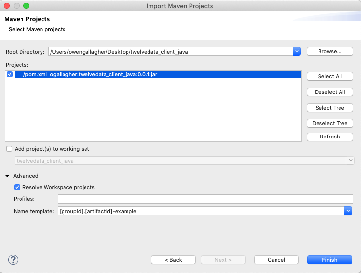

# Twelvedata Java Client

Java client to provide a convenient abstraction between a Java application and the twelvedata market API.

## Test Driver

I've included a test driver compatible with Java 13 and JavaFX for testing and as an example. Below are
instructions for installing it:

### Clone or download

Clone or download this project to have it locally. In this example I'll clone it.

```bash
cd <parent-dir>
git clone https://github.com/ogallagher/twelvedata_client_java
cd twelvedata_client_java
```

### Get git submodule `temp_fx_logger`

I use another project as a git submodule, whose source can be populated from the remote origin branch 
into the `temp_fx_logger/` directory like so:

```bash
git submodule update --init --recursive
```

### Create project in IDE (Eclipse)

I develop Java projects in Eclipse, so I'll use it as the IDE for these instructions. The Twelvedata client also uses 
**retrofit** as a dependency, referenced for the Maven dependency manager in `pom.xml`.

In Eclipse, use the [m2eclipse plugin](https://stackoverflow.com/a/2061645) to import the project using that existing
`pom.xml` to fetch needed `.jar` files at `File > Import > Existing Maven Projects`.


Use the `twelvedata_client_java/` parent directory that contains `pom.xml` as the project directory, and select the `pom.xml`
file from there. 

> _Note I needed to add a custom project name since I already have this project in Eclipse._



Click `Finish`.

### Fix project configuration

In some cases, the default config for the Maven project import is not enough, as it expects a certain project hierarchy that
**twelvedata_client_java** doesn't adhere to. To fix this, go to `Project > Properties > Java Build Path` and make sure
that the source folders are `src/`, `test/` and `temp_fx_logger/src`.


### Run Test Driver

Open `test/ogallagher/twelvedata_client_java/test/TestDriver.java`. Run it.

Since Eclipse doesn't yet have any run configurations for this project, it may prompt you to provide the entrypoint class,
which is `ogallagher.twelvedata_client_java.test.TestDriver`.

.

If the test driver run is successful, the output should look like so:


### Provide config file with valid api key

In order to access all parts of the Twelvedata API, you'll need to [get a free api key](https://twelvedata.com/apikey).

Once you have the key, you can duplicate the example config file at `src/ogallagher/twelvedata_client_java/resources/config_dummy.json`
with the name `config.json` and replace `"<your-api-key>"` with your api key.

Once that's done, run the test driver again, and you'll see you're able to fetch historical prices (time series)
for an example stock!


## Technologies

**[retrofit](https://square.github.io/retrofit/)** web API framework, for converting requested data in exchange format to Java objects.

## Authors

- [Owen Gallagher](https://github.com/ogallagher)

